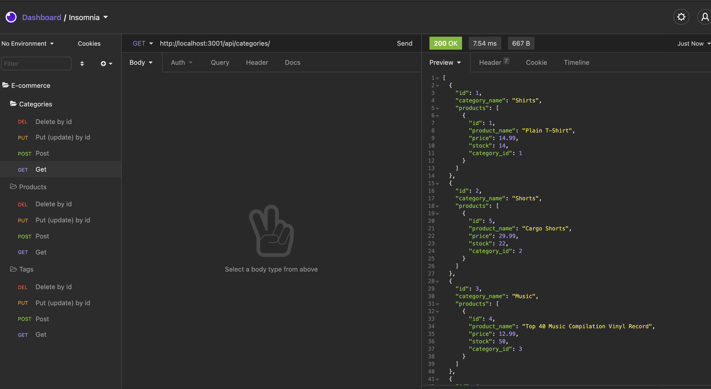

# E-Commerce Back End


[](https://github.com/git/git-scm.com/blob/main/MIT-LICENSE.txt)

## Description

 Internet retail, also known as **e-commerce**, is the largest sector of the electronics industry, generating an estimated $29 trillion in 2019. E-commerce platforms like Shopify and WooCommerce provide a suite of services to businesses of all sizes.

 In this application I built the back end for an e-commerce site and configured a working Express.js API to use Sequelize to interact with a MySQL database.

  I used to insomnia to check/ test the api was working correctly by testing:
  * GET routes for all categories, all products, and all tags.
  * GET routes for a single category, a single product, and a single tag.
  * POST, PUT, and DELETE routes for categories, products, and tags

  ```md
  AS A manager at an internet retail company
  I WANT a back end for my e-commerce website that uses the latest technologies
  SO THAT my company can compete with other e-commerce companies
  ```

## Table of Contents
  * [Installation](#installation)
  * [Usage](#usage)
  * [Links](#links)
  * [License](#license)
  * [Contributions](#contributions)
  * [Questions](#questions)
  
  
## Installation

Make sure to have node.js installed before running application:
https://nodejs.org/en/download/package-manager/

Install package.json contents by running: 

```bash
npm install
```

## Usage

 

  The application will be invoked by using the following command:

```bash
npm run start
or
npm run watch
```

 ## Links
 
  * Github Repository URL: (https://github.com/CliffordMorin/E-Commerce-Back-End)
  * Video Walk-through application: (https://drive.google.com/file/d/1bQbyW2V5Y_6uKIzc7t7RVvIlMfsYb_aV/view) 

## License

  [](https://github.com/git/git-scm.com/blob/main/MIT-LICENSE.txt)

## Contributions

  Fork, request, or contact me.
  

## Questions

  [](https://github.com/CliffordMorin) 
  [](https://www.linkedin.com/in/morin-clifford-129888a9/)

  Feel free to reach me at cemorin21@gmail.com with any question regarding this project!
  